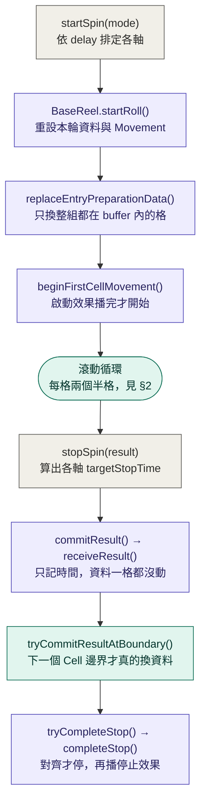
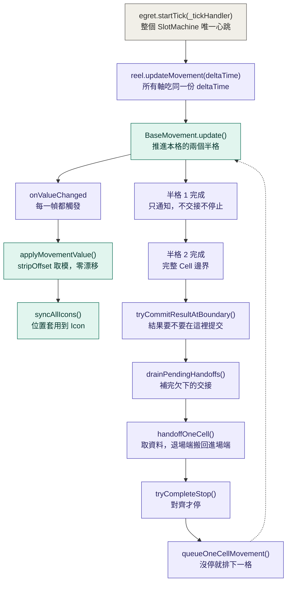

# 執行期流程：從心跳到停輪

> 對象：`src/SlotMachine/Core`
> 姊妹文件：[Slot-Base-Unit-Refactor-1x1.md](Slot-Base-Unit-Refactor-1x1.md)（設計決議）、[Core-Responsibility-Slimming.md](Core-Responsibility-Slimming.md)（責任重劃）
>
> **本文一律以「類別.成員」指路，不寫行號。** 行號會被重排洗掉，指錯比不指更糟。
> 唯一的例外在 §2.3，那裡真正需要描述同一個方法內部的先後順序。

---

## 1. 外層：一輪 Spin



灰＝`BaseSlotMachine`，紫＝`BaseReel`，綠＝內部類別。

| 步驟 | 所在 |
|---|---|
| `startSpin()` / `startDueReels()` / `startOneReel()` | `BaseSlotMachine` |
| `startRoll()` / `replaceEntryPreparationData()` / `beginFirstCellMovement()` | `BaseReel`（區塊：建立、主線） |
| `stopSpin()` | `BaseSlotMachine` |
| `commitResult()` | `BaseReel`（區塊：主線） |
| `receiveResult()` / `tryCommitResultAtHandoff()` | `ReelStopFlow` |
| `commitResult()` | `ReelDataFlow` |
| `tryCompleteStop()` / `completeStop()` | `BaseReel`（區塊：主線） |

### 1.1 `commitResult()` 和換資料差了一個 Cell 邊界

這是讀程式碼最容易誤會的一點：

- **`BaseReel.commitResult()`** 只做三件事 —— 驗證、呼叫 `ReelStopFlow.receiveResult()`、切到 `Stopping` 狀態。
- **`ReelStopFlow.receiveResult()`** 是六行賦值，記下 `_visibleResult`、`_resultReceivedTime`、`_resultReceivedMovementTime`，**一格資料都沒動**。
- 真正把結果塞進資料流的是 **`BaseReel.tryCommitResultAtBoundary()`**，它只在 `_secondHalfCompleteHandler` 被呼叫，也就是下一個完整 Cell 邊界。

中間隔多久，取決於下一個 Cell 邊界何時到來。

---

## 2. 內層：每格 Cell 的心跳循環



| 步驟 | 所在 |
|---|---|
| `_tickHandler` | `BaseSlotMachine`（推進每一個 `inited` 的 Reel） |
| `updateMovement()` | `BaseReel`（區塊：主線） |
| `_movementValueChangedHandler` / `_firstHalfCompleteHandler` / `_secondHalfCompleteHandler` | `BaseReel`（區塊：內部 handler） |
| `applyMovementValue()` / `syncAllIcons()` | `ReelIconManager` |
| `tryCommitResultAtBoundary()` / `drainPendingHandoffs()` / `handoffOneCell()` | `BaseReel`（區塊：主線） |
| `tryCompleteStop()` / `queueOneCellMovement()` | `BaseReel`（區塊：主線） |

### 2.1 心跳只有一個，而且不分作用軸

```ts
// BaseSlotMachine._tickHandler
for (const reel of this._runtimeReels) {
    if (reel.inited) {
        reel.updateMovement(deltaTime);
    }
}
```

推進的是**每一個** `inited` 的 Reel，不只本輪在轉的那幾軸 —— 停輪後的停止效果仍需要時間播完，閒置的軸在 `updateMovement()` 內自行略過。

所有軸吃同一份 `deltaTime`，**這是 Turbo 同步停輪成立的前提**。`deltaTime` 另有上限 `BaseSlotMachine.MAX_DELTA_TIME = 0.1`，避免分頁切回來時一次補太多。

### 2.2 位置與交接是兩條獨立節奏

| 路徑 | 頻率 | 內容 |
|---|---|---|
| 左（`onValueChanged`） | **每幀** | `applyMovementValue()` → `syncAllIcons()` |
| 右（半格 callback） | **每半格** | 第 1 個半格只通知；第 2 個半格才提交、交接與判停 |

這個分家是 1×1 之後才成立的。`stripOffset` 由取模得到、`_travelledCellCount` 由整除得到，是**同一次除法的兩半**（`ReelIconManager.applyMovementValue()`）：

```ts
this._travelledCellCount = Math.floor(travelled / cellPitch);
this._stripOffset = travelled - this._travelledCellCount * cellPitch;
```

所以「現在在哪」和「該回收幾格」不需要任何幾何比較或容差 —— 這正是決議 #15、#17 的落地處。

### 2.3 提交必須排在回收之前

`BaseReel._secondHalfCompleteHandler` 的三段順序不能換：

```ts
this.tryCommitResultAtBoundary();   // ① commitResult() 會換掉資料列表未讀的尾段
this.drainPendingHandoffs();        // ② 接著的回收才讀得到新資料
this.onHalfCellComplete?.(2);
this.onCellMovementComplete?.();

if (!this.tryCompleteStop()) {      // ③ 對齊就停，否則排下一格
    this.queueOneCellMovement(this._moveInterval);
}
```

這與 v3 `UniReel.moveOnceComplete()` 的分工相同 —— v3 的判停也在 `moveOnceComplete`，不在換資料的 `setIconData`。

> **`_secondHalfCompleteHandler` 觸發時，`pendingHandoffCount` 必定 ≥ 1。**
> 依據在 `BaseMovement.update()` 的迴圈：一段 Movement 結束時先 `applyValue(active.endValue)`
> 校正到精確終點（因而觸發 `onValueChanged` → `applyMovementValue()` 更新
> `_travelledCellCount`），**之後**才把下一個 Callback 指令出列執行。
> 這是本文唯一需要看程式碼內部順序的地方。

### 2.4 低幀率時一次交接多格

```ts
// BaseReel.drainPendingHandoffs()
while (this._iconManager.pendingHandoffCount > 0) {
    this.handoffOneCell();
}
```

位置每幀更新但交接只在 Cell 邊界執行，所以掉幀時 `pendingHandoffCount` 會累積，這裡一次補完。
`ReelIconManager.recycleExitedCell()` 與 `recycleExitedCellKeepingData()` 都會遞增 `_handedOffCellCount`，迴圈必定收斂。

### 2.5 `handoffOneCell()` 的職責 = v3 的三個方法

| `handoffOneCell()` | v3 對應 |
|---|---|
| `consumeNextData()` 取下一筆，順帶判斷在不在結果區段並打 `resultSpinId` | `UniReel.getData()` |
| `recycleExitedCell()`：換資料、推導 `groupOffset` | `UniReel.setIconData()` |
| 同上：`pop()` / `unshift()` | `UniReel.reArrangeIcon()` |
| `onReelDataChanged?.()` | `UniReel.onSetIconData?.()` |

**`groupOffset` 推導是 v3 沒有的**（v3 無大 Symbol）。除此之外職責一致。

兩個刻意的差異：

1. **v3 的「搬回進場端」是 Movement 指令**（`moveTo(topPos, 0)` 插在兩個 `moveBy` 之間），位置是被設定的；我們的位置是算的，回收只是陣列操作，不碰座標。
2. **交接時機不同**：v3 在兩個半格中間換資料（buffer 只有一格，非這樣不可），我們在整格結束才換（buffer 有 `maxCellSpan` 格餘裕）。見決議 #15。

---

## 3. 這張圖暴露的結構問題

內部類別**不能互相說話**，全部要繞回 `BaseReel` 轉一手。

`ReelStopFlow` 與 `ReelDataFlow` 需要 `ReelIconManager.getCellSpan()`、`ReelIconManager.validateData()` 與 `BaseReel.getNextPerformanceData()`，但它們拿不到那些物件，於是 `BaseReel` 開了三個轉接器（區塊：內部 handler）：

```ts
private readonly _performanceDataProvider = (): SymbolData => {
    return this.getNextPerformanceData();
};
private readonly _cellSpanResolver = (data: SymbolData): number => {
    return this._iconManager.getCellSpan(data);
};
private readonly _flowDataValidator = (data: SymbolData, label: string): void => {
    this._iconManager.validateData(data, label);
};
```

實測散佈：

| 項目 | 數量 |
|---|---:|
| 轉接器定義 | 3 |
| `BaseReel` 內的傳遞點（建構 `ReelStopFlow`、`setPerformanceDataBank`、`appendPerformanceData`、`applyQuickStopPadding`、`consumeNextData`） | 5 |
| `ReelDataFlow` 方法簽章提及次數 | 41 |

也就是說 §2 圖裡 `handoffOneCell → consumeNextData → recycleExitedCell` 看起來的三步，實際上一直在
`BaseReel → ReelDataFlow → 回呼 BaseReel → ReelIconManager` 之間彈跳。

**這是 [Core-Responsibility-Slimming.md](Core-Responsibility-Slimming.md) 決議 21／22 的第三項證據**（前兩項是「檔名對不上內容」與「7 個唯讀 getter」）。strip 與 Registry 收回 `BaseReel` 之後，`_cellSpanResolver` 與 `_flowDataValidator` 會直接消失 —— 它們要找的東西屆時就在同一個物件上。

### 3.1 熱路徑觸及的檔案

`handoffOneCell()` 一次交接（資料充足時）會走過：

```
BaseReel → ReelDataFlow → ReelDataList → ReelIconManager → ReelSymbolRegistry
```

**5 個檔。** 停輪規劃移出之後 `ReelStopFlow` 已經退出熱路徑（原本是 6 個）。
決議 21 完成後可再降到 4 個（`ReelIconManager` 退出資料路徑，只留顯示）。
